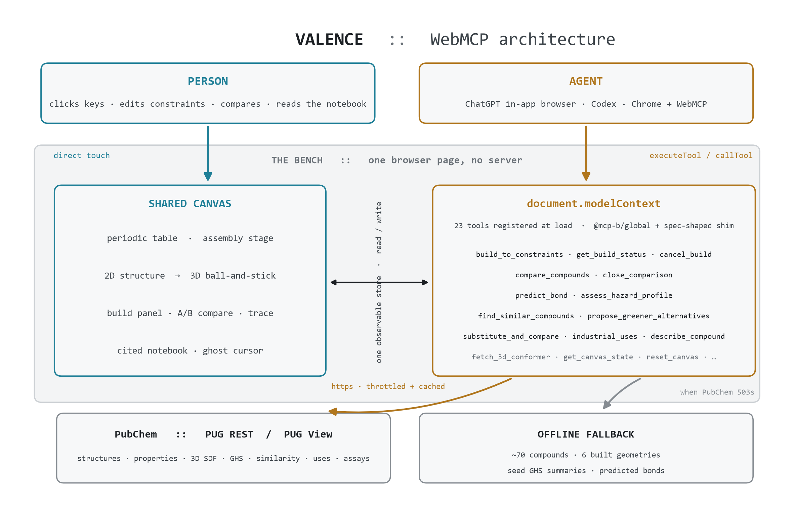

# Valence

**A playable periodic table, wired to PubChem, that an AI agent can operate through WebMCP.**

Click two element keys and a real molecule assembles on the stage: 2D structure, then a
rotatable 3D conformer, live properties, and a GHS hazard badge. Or type a goal and watch
an agent do it: search PubChem, assemble candidates, check every hazard record, score them,
and put the winner on the same canvas you were touching. Every claim in the notebook links
back to the exact PubChem endpoint it came from, with the time it was fetched.

- **Live:** <https://valence-lime.vercel.app>
- Built for the [OpenAI WebMCP Challenge](https://webmcp.devpost.com/).

---

## Why this is a WebMCP project

The value is **shared control of a live client canvas**. A backend API cannot move the
pieces on the user's screen. WebMCP can. Valence registers 23 typed tools on
`document.modelContext` (the surface ChatGPT's built-in browser, Codex, and Chrome read),
with a spec-shaped shim for browsers that have no native runtime. The person and the agent
call the same tools and mutate the same observable store, so the stage is always a single
source of truth.

The built-in operator (a small heuristic planner, no API keys) invokes those tools through
`document.modelContext.executeTool` — the exact path an external agent uses. A judge in
ChatGPT's in-app browser or Chrome with WebMCP enabled drives them the same way.

### For beginners

Valence is built to be explored with no chemistry background. Select two element keys and the
Workbench bar tells you **whether they bond and why** — ionic, covalent, alloy, or not at all —
from electronegativity and valence, before any lookup. `predict_bond`, `describe_compound`,
and `explain` are the teaching tools; the periodic table works with the mouse or the keyboard.

---

## Architecture



One page, no server. Person and agent act on one observable store; the WebMCP tool layer is
the only thing that talks to PubChem, with a bundled offline set for when PubChem rate-limits.

### The 23 tools

All registered on `document.modelContext`. Every property and hazard reading carries its
provenance (PubChem live, PubChem cached, bundled reference, or "not checked") with a fetch
timestamp.

**Selection and bonding** (offline, no network)

| Tool | Input | Effect |
|---|---|---|
| `select_elements` | `symbols[]` | Set the table selection, arm the stage |
| `predict_bond` | `symbols[]` | Will these elements bond, and why? Bond type, likely formula, plain-language reason from electronegativity and valence |
| `combine_selection` | `stoichiometry?` | Resolve the current selection to a real compound and stage it |

**PubChem lookup**

| Tool | Input | Effect |
|---|---|---|
| `search_pubchem` | `query`, `by` | Resolve a name / formula / SMILES / InChIKey to CIDs |
| `fetch_properties` | `cid` | MW, TPSA, logP, H-bond donors/acceptors, rotatable bonds |
| `fetch_3d_conformer` | `cid` | Fetch an SDF and render a ball-and-stick model |
| `assess_hazard_profile` | `cid` | GHS signal word, pictograms, hazard statements, stated as evidence |
| `describe_compound` | `cid` | Plain-language description and common names |
| `industrial_uses` | `cid` | What the compound is used for, from PubChem Uses annotations |
| `industrial_viability` | `cid` | Vendor and patent counts, sourcing verdict |
| `bioactivity_bridge` | `cid` | Active assay count, tested targets, pharmacology |

**Design and comparison**

| Tool | Input | Effect |
|---|---|---|
| `find_similar_compounds` | `smiles`, `threshold` | 2D similarity search with a green-chemistry score |
| `compare_compounds` | `a`, `b` | Put two compounds side by side on the canvas: structures, property deltas, descriptions |
| `close_comparison` | — | Leave the side-by-side view |
| `substitute_and_compare` | `base_smiles`, `change` | Apply a substituent, report the property shift |
| `propose_greener_alternatives` | `cid_or_smiles` | Rank similar compounds by a transparent green score |

**Constraint solve** (async job)

| Tool | Input | Effect |
|---|---|---|
| `build_to_constraints` | `goal`, `constraints` | Start a job: resolve, de-duplicate, hazard-check and score candidates, rank, stage the winner |
| `get_build_status` | `jobId?` | Poll a build: phase, progress, and the ranked candidates with each score's breakdown and rejection reason |
| `cancel_build` | `jobId?` | Stop a running build; it commits whatever it has fully ranked |

**Utility**

| Tool | Input | Effect |
|---|---|---|
| `render_recipe_card` | — | Export the build as a downloadable PNG card |
| `explain` | `topic` | Teach mode: explain a concept the bench uses |
| `get_canvas_state` | — | Full bench state as JSON, provenance included |
| `reset_canvas` | — | Clear the selection and the stage |

---

## Run it

```bash
npm install
npm run dev      # http://localhost:5199
```

```bash
npm run build && npm run preview
```

PubChem PUG REST and PUG View are called directly from the browser. A Node serverless proxy
lives in `api/pug/`; to route through it on a deploy, set `VITE_PUBCHEM_PROXY=/api/pug`.

## Test it as an agent would

- **ChatGPT in-app browser**, or **Chrome** with WebMCP testing enabled.
- Open the page. The tools register on load (the dot by the wordmark turns on).
- Ask your agent, for example: *"will sodium and chlorine bond?"*, *"make CO2"*, *"build a non-toxic polymer precursor using only period-2 elements"*, then *"how hazardous is it?"*, *"what is it used for?"*, *"aspirin vs ibuprofen"*.
- Or open the console and call the tools directly:
  ```js
  const tools = await document.modelContext.getTools();
  const t = tools.find(x => x.name === "predict_bond");
  await document.modelContext.executeTool(t, JSON.stringify({ symbols: ["Na", "Cl"] }));
  ```

## Quick start

1. Click **H**, then **O**. The stage arms. `combine_selection` → water; 2D settles into 3D; low hazard.
2. Type *"build a non-toxic polymer precursor using only period-2 elements"*. The agent traces the period-2 keys, resolves candidates, checks the GHS record on every one, scores them on a transparent rubric, and stages 1,3-propanediol — with a ranked table, each rejected candidate showing why, and a cited notebook trail.
3. Change a constraint in the build panel and **Re-run**, or click **vs winner** on a candidate to open a grounded A/B comparison.
4. **Export** the recipe card. Show the notebook, every line linked to a PubChem CID.

---

## Stack

Vite + TypeScript, no framework. [`@mcp-b/global`](https://www.npmjs.com/package/@mcp-b/global)
for the `document.modelContext` runtime, [3Dmol.js](https://3dmol.csb.pitt.edu/) for the 3D
viewer, [smiles-drawer](https://github.com/reymond-group/smilesDrawer) for 2D structures.
Data from [PubChem](https://pubchem.ncbi.nlm.nih.gov/) (PUG REST + PUG View), with a bundled
offline set of ~70 common compounds for outages.

`docs/Valence-chemistry-primer.docx` is a plain-language refresher on every concept the
bench surfaces; `src/data/glossary.ts` is the teach-mode subset.

## License

MIT. See [LICENSE](LICENSE).
